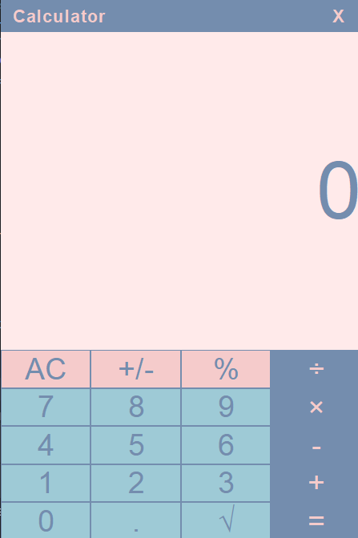

# Calculator-Java

Java Swing kullanılarak geliştirilmiş, temel hesaplama işlemlerini kolayca yapabileceğin sade ve pratik bir hesap makinesi uygulaması.

## Özellikler

- Toplama, çıkarma, çarpma, bölme işlemleri  
- Karekök alma fonksiyonu  
- Kullanıcı dostu ve basit grafik arayüz (GUI)  
- Hızlı ve stabil çalışma  

## Kurulum & Çalıştırma

1. Repoyu klonla:  
   ```bash
   git clone https://github.com/YunuSezer/Calculator-Java.git

2.Projeyi IntelliJ IDEA veya herhangi bir Java IDE’sinde aç.

3.Main class ile uygulama başlatılır. (Java 8 veya üstü)


